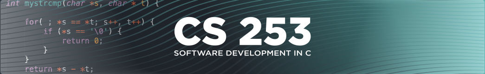

# Module 3 Code Examples
## Getting Started
To get started working with these examples, please clone this repository into your development environment  

Steps to Clone Examples
1. Copy the URL for this repo by clicking the green "Code" button above, select HTTPS then click the copy icon.
2. Open VSCode, click the Source Control icon then click Clone Repository.
3. Paste the repo URL into the "Provide repository URL" field and press Enter.
4. Browse to the location in your development environment where you want to store the repostory and click Select Repository Location.
5. When prompted, Open the repository then Open the workspace.